# Продвинутое администрирование. Модуль 33. Проект «Мессенджер».

Практическая работа

## Задание 33.1

### Разработан браузерный мессенджер, позволяющий пользователям обмениваться сообщениями в реальном времени. Взаимодействие Frontend и Backend производиться в асинхронном режиме с применением WebSocket.

#### Приложение построено с применением Docker контейнеров:
- Nginx
- PHP
- MySQL
- phpmyadmin

Контенеры собраны из образов на основе docker-compose.yaml и Dockerfile. Запуск контенеров осуществляется в терминале командой docker-compose up -d.
В файле hosts необходимо прописать: 127.0.0.1 messenger.local.

Для работы приложения надо в контейнере PHP через composer установить все необходимые библиотеки:
- подключиться к контенеру PHP: docker exec -it messenger-php bash
- перейти в директорию: cd code
- выполнить: php composer.phar install
Для запуска PHP WebSocket сервера необходимо:
- подключиться к контенеру PHP: docker exec -it messenger-php bash
- перейти в директорию: cd app/core
- запустить серевер: php wsserver.php

#### Описание работы приложения:

- Пользователь, который заходит на сайт мессенджера, должен выполнить первичную регистрацию на сайте, в качестве логина выступает email пользователя. При регистрации ему на указанную почту приходит письмо с кодом подтверждения. Если в системе уже есть пользователь с таким email, будет выведено сообщение об этом, также производится проверка длинны пароля .
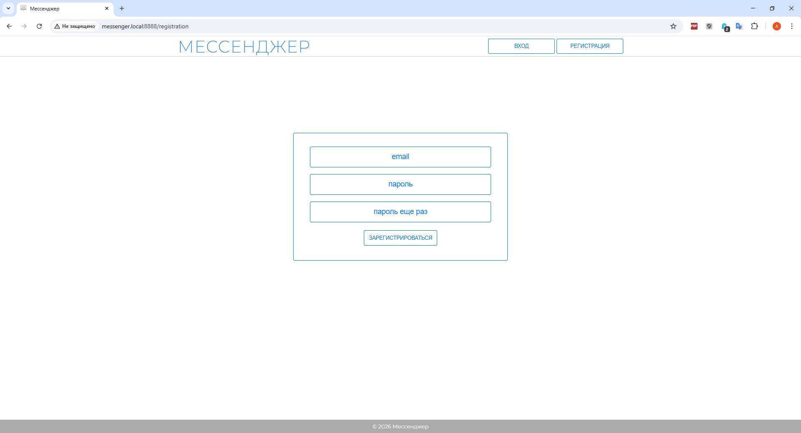

- После успешной регистрации будет предложено авторизоваться.
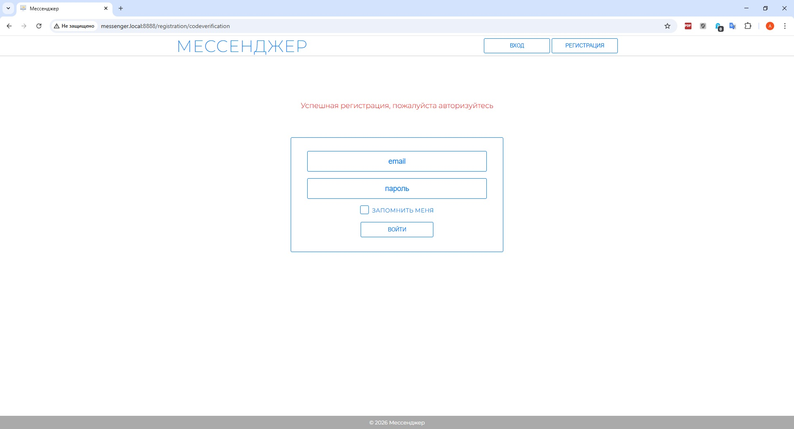
- После входа в мессенджер, у пользователя есть возможность редактировать свой профиль, где он может:
    - задать или изменить свой nickname, который уникален, если он занят в системе, то об этом будет выдаваться предупреждение.
    - задать или изменить свой аватар, до смены аватара показывается стандартная картинка.
    - скрыть или показать свой email, в случае, если задан nickname.

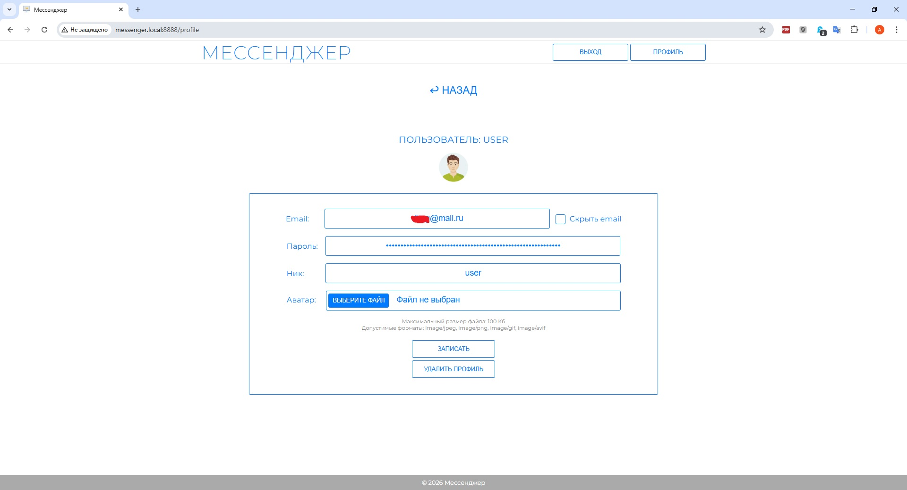
- Далее пользователь может добавить в свои контакты пользователей зарегистрированных в мессенджере.
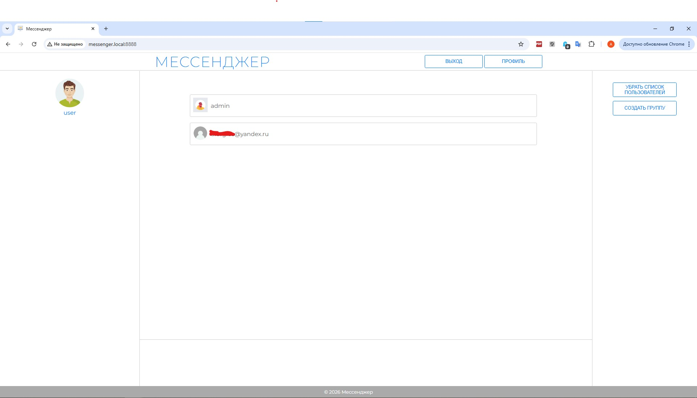
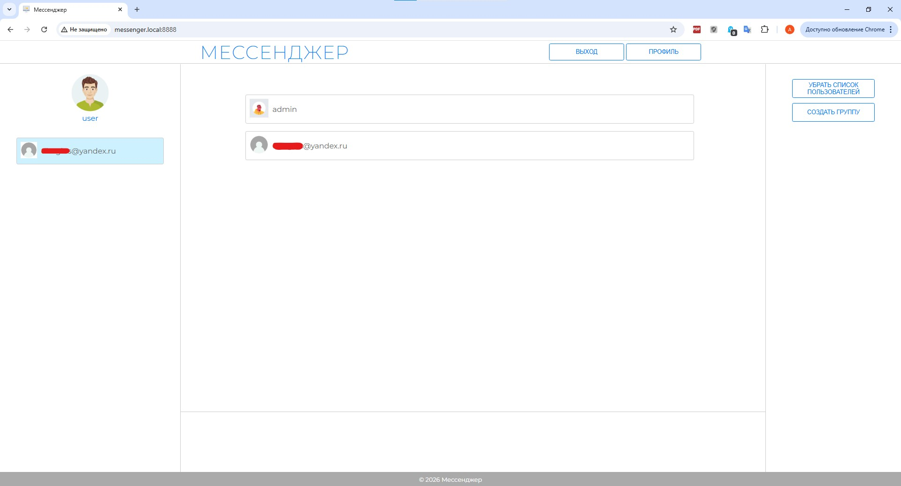
- При добавлении пользователя в контакты, у добавленного пользователя также добавляется контакт добавившего его пользователя и ему направляется сообщение.

- При входе в чат этот пользователь в списке контактов выделяется цветом.
- Далее можно обмениваться сообщениями в реальном времени. Если не отключено оповещение, то при послуплении сообщения будет воспроизводиться звуковой сигнал.
Если открыт чат с другим пользователем или другое окно, то при поступлении сообщения пользователь от которого пришло сообщение будет выделен цветом, если не открыто ни чего, то откроется чат с пользователем от которого пришло сообщение.
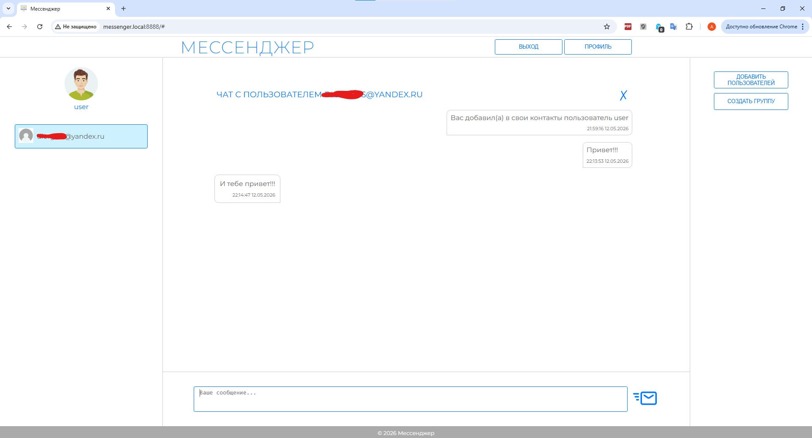
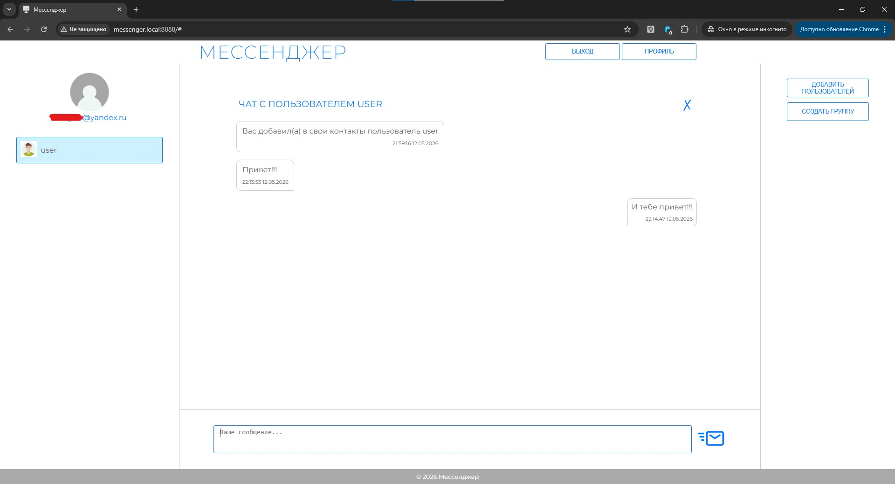
- При клике на контакте открывается меню, в котором можно включить/отключить оповещение (пользователь будет выделен цветом), удалить пользователя из списка контактов, удалить переписку с контактом.
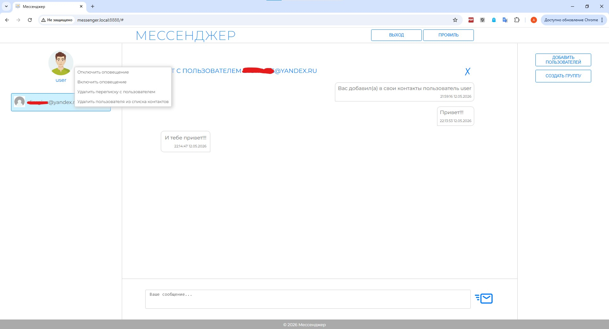
- При клике на сообщении открывается меню, в котором можно удалить сообщение, редактировать сообщение, переслать сообщение пользователям из своих контактов.
При удалении сообщения, текст заменяется на "Сообщние удалено" в интерфейсе и БД, на сообщении делается пометка, кем удалено сообщение. При редактировании текст сообщения подгружается в поле ввода сообщения, а после изменения перезаписывается как в интерфейсе пользователей чата, так и в БД, на сообщении делается пометка, кем отредактировано сообщение. При пересылке сообщения оно отсылается адресату, делается запись в БД, на сообщении делается пометка, кем переслано сообщение.
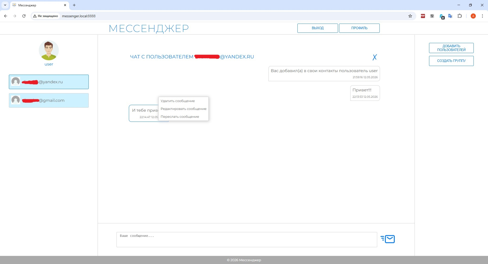
- В мессенджере предусмотрено создание групповых чатов.
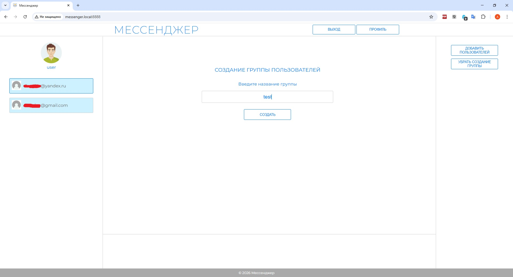
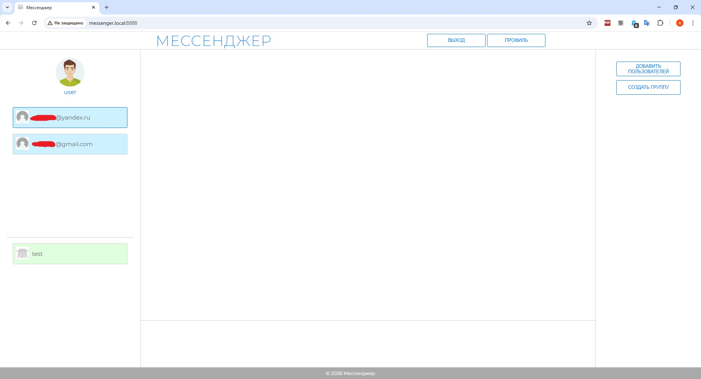
- При клике на группе открывается меню, в котором можно включить/отключить оповещение, добавить пользователей в группу, вывести список участников группы, в котором можно удалить пользователей из группы, покинуть группу, удалить группу. Удалить пользователей из группы и удалить группу может только ее администратор.

- Добавление пользователей в группу. При добавлении в группу она появляется в интерфейсе добавленного пользователя и направляется сообщение в группу о добавлении участников.
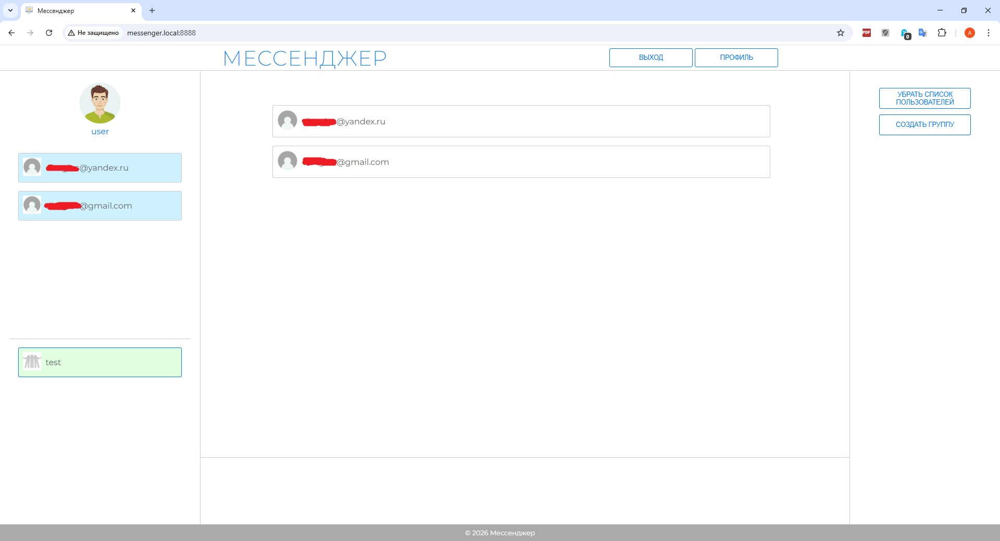
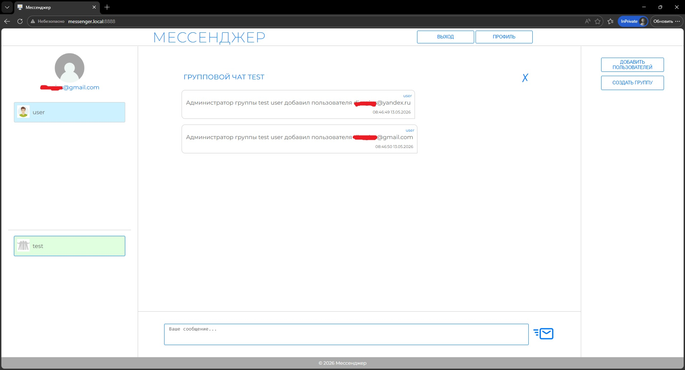
- Список пользователей группы.
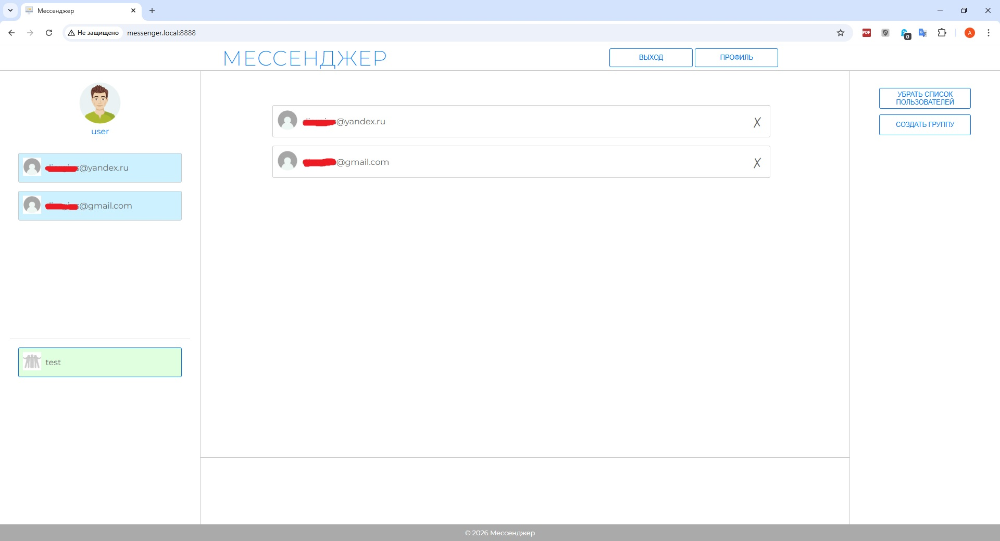
- После добавления пользователей в группу, можно производить переписку в реальном времени.
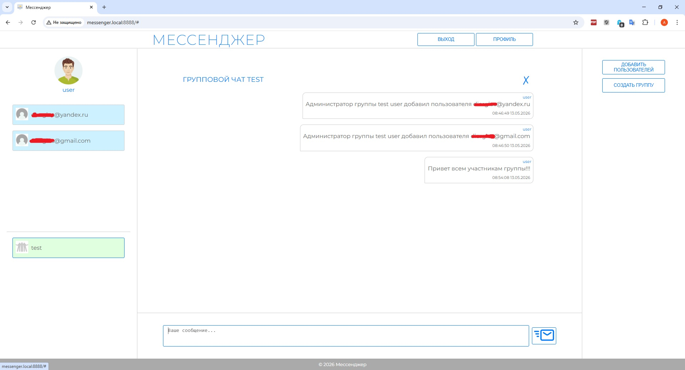
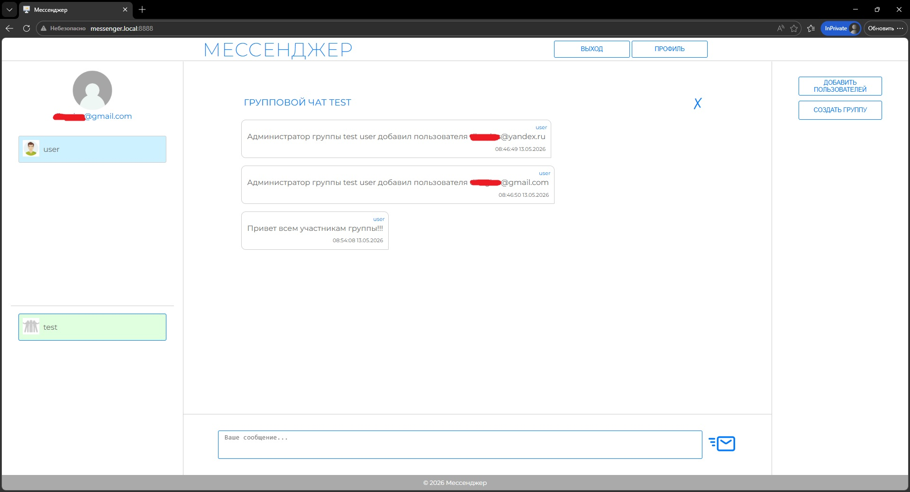
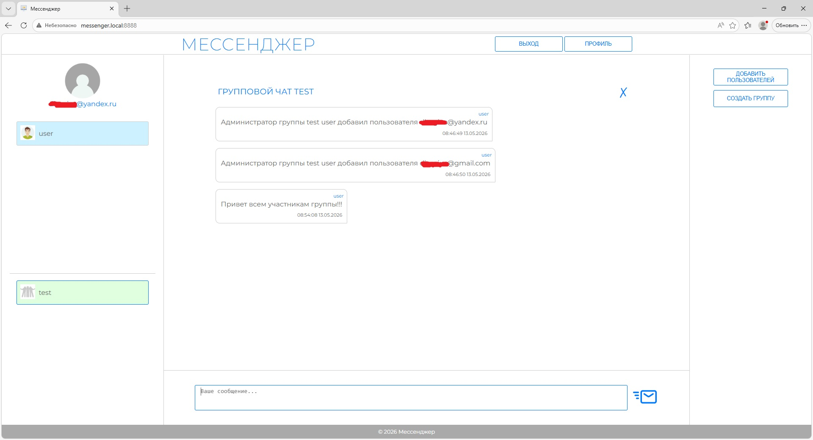

--------

## Используемые технологии

* HTML
* PHP
* WebSocket (Ratchet)
* JS
* CSS
* MySQL
* Docker