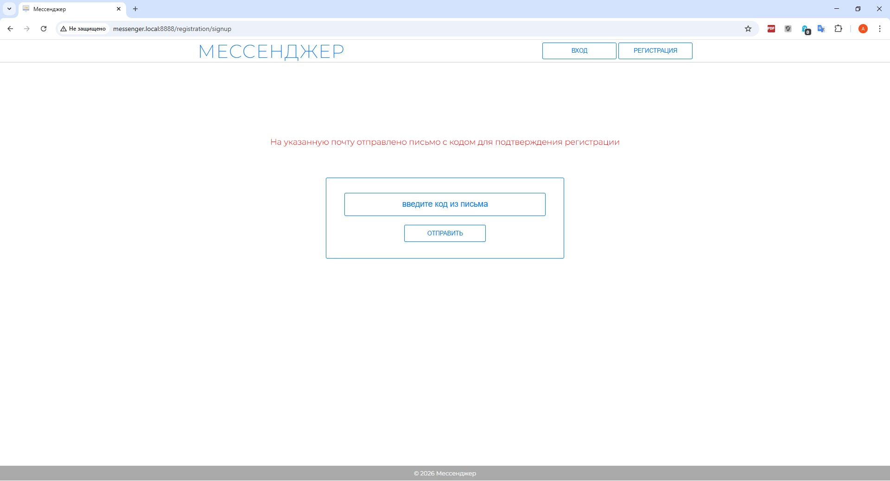
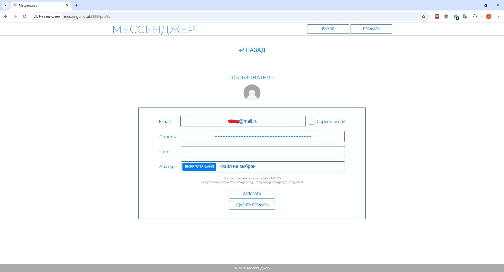

# Продвинутое администрирование. Модуль 33. Проект «Мессенджер».

Практическая работа

## Задание 33.1

### Разработан браузерный мессенджер, позволяющий пользователям обмениваться сообщениями в реальном времени. Общение Frontend и Backend производиться в асинхронном режиме с применением WebSocket.

- Пользователь, который заходит на сайт мессенджера, должен выполнить первичную регистрацию на сайте, в качестве логина выступает email пользователя. При регистрации ему на указанную почту приходит письмо с кодом подтверждения регистрации. Если в системе уже есть пользователь с таким email, будет выведено сообщение об этом.

- После успешной регистрации будет предложено авторизоваться.

- После входа в мессенджер, у пользователя будет возможность редактировать свой профиль, где он может:
    - задать или изменить свой nickname, который уникален, если он занят в системе, то об этом будет выдаваться предупреждение.
    - задать или изменить свой аватар. При отсутствии показывается стандартная картинка.
    - скрыть или показать свой email, в случае, если задан nickname.

- Далее пользователь может добавить в свои контакты 

--------

## Используемые технологии

* HTML
* PHP
* JS
* CSS
* MySQL
* Docker