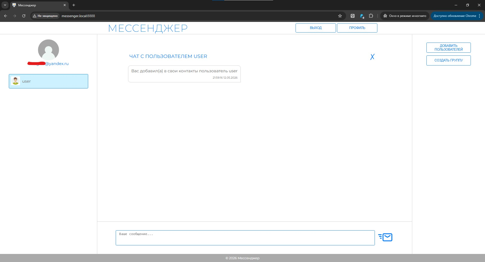

# Продвинутое администрирование. Модуль 33. Проект «Мессенджер».

Практическая работа

## Задание 33.1

### Разработан браузерный мессенджер, позволяющий пользователям обмениваться сообщениями в реальном времени. Взаимодействие Frontend и Backend производиться в асинхронном режиме с применением WebSocket.

- Пользователь, который заходит на сайт мессенджера, должен выполнить первичную регистрацию на сайте, в качестве логина выступает email пользователя. При регистрации ему на указанную почту приходит письмо с кодом подтверждения. Если в системе уже есть пользователь с таким email, будет выведено сообщение об этом, также производится проверка длинны пароля .

- После успешной регистрации будет предложено авторизоваться.

- После входа в мессенджер, у пользователя есть возможность редактировать свой профиль, где он может:
    - задать или изменить свой nickname, который уникален, если он занят в системе, то об этом будет выдаваться предупреждение.
    - задать или изменить свой аватар, до смены аватара показывается стандартная картинка.
    - скрыть или показать свой email, в случае, если задан nickname.

- Далее пользователь может добавить в свои контакты пользователей зарегистрированных в мессенджере.

- При добавлении пользователя в контакты, у добавленного пользователя также добавляется контакт добавившего его пользователя и ему направляется сообщение.

- Далее можно обмениваться сообщениями в реальном времени

- При клике на контакте открывеется меню, в котором можно включить/отключить оповещение, удалить пользователя из списка контактов, удалить переписку с контактом

--------

## Используемые технологии

* HTML
* PHP
* WebSocket (Ratchet)
* JS
* CSS
* MySQL
* Docker